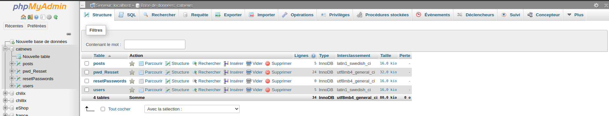
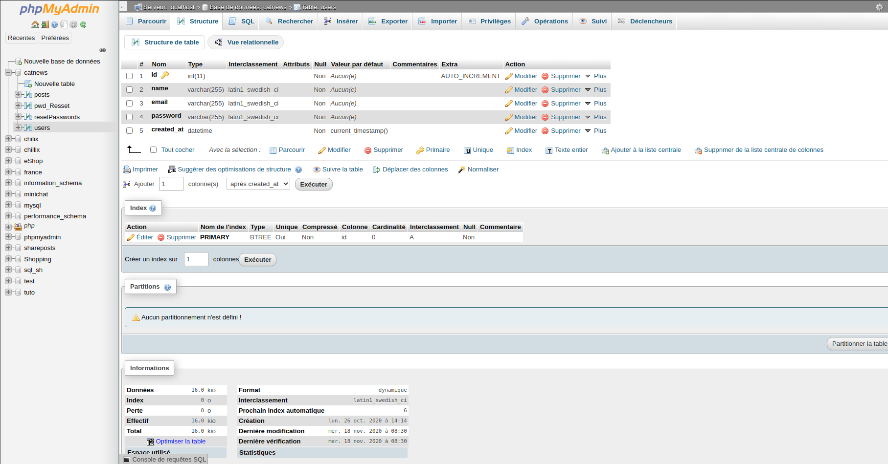
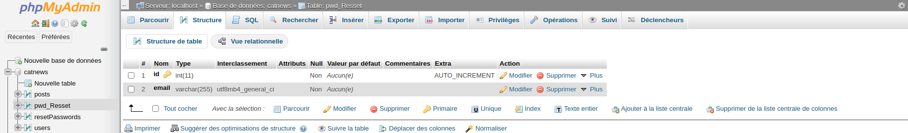
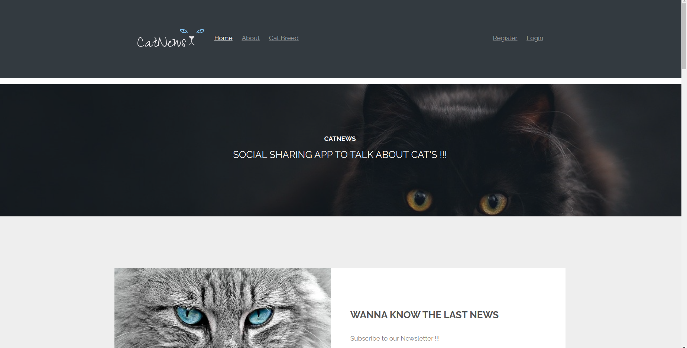
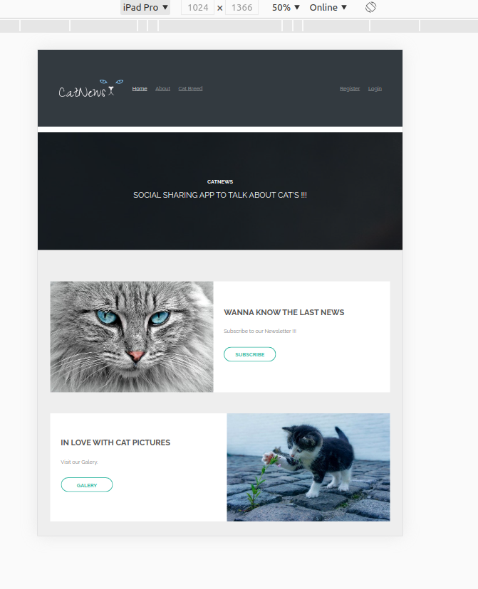
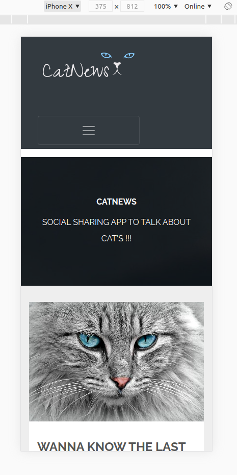
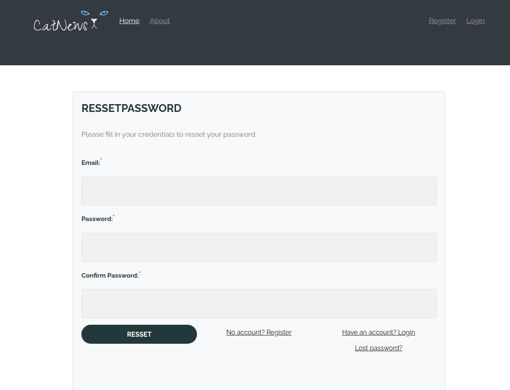
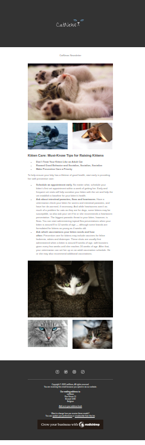

# npProject
BeCode's npProject
## visit the App: http://catnews.epizy.com/

-duration : 4 weeks

- Déploiement :
  
  - self-hosting
  - infinityfree
  
- Team challenge : `solo`

## Objectifs

Créate a realistic project in 1 month

## The Mission

### thème :

- News portal :CATNEWS

SOCIAL SHARING APP TO TALK ABOUT CAT'S!!!

This site is gonna be a news site about cat's

It's a complete custom MVC (Model View Controller) framework similar to Codeigniter but much much lighter based on the Udemy course : [Object Oriented PHP & MVC](https://www.udemy.com/course/object-oriented-php-mvc/)

- A core library class to load controllers & methods from the URL (Also using .htaccess)
- A base controller class to load models and views
- A custom database library using PDO for all models to interact with the database using prepared statements

On top of this mini framework I build CatNews: a social network to share posts about cats. This application includes:

- Full user authentication
- Access control for posts
- Server side form validation
- Posts CRUD
- Helper functions (flash messaging & redirects)
- Lost password with PHP mailer

##Technologie

### Used languages and framework in MVC structure :
* HTML5
* CCS3
* PHP OOP
* Bootstrap 4 UI
* PHP mailer

#### Back :

- PHP OOP
- MYSQL

#### Front :

- Bootstrap 4 UI
- Css3
- [Parts of retrospect template](https://templated.co/retrospect/)

## Api

- [OpenWeatherMap with PHP](https://phppot.com/php/forecast-weather-using-openweathermap-with-php/)
- [Mailchimp](https://mailchimp.com/)

  -Integrate a newsletter with Mailchimp.
  
  -Integrate a image galery with Mailchimp.

## Présentation (16 novembre)

## Ressources
- [FreeLodoDesign](https://fr.freelogodesign.org/)
- [Images from Pixabay](https://pixabay.com/fr/images/search/chat/)
- [W3schools](https://www.w3schools.com/)
- [PHP Documentation](https://www.php.net/docs.php)
- [Object Oriented PHP & MVC](https://www.udemy.com/course/object-oriented-php-mvc/)

## Screenshots of:

### the database

#### Database Structure

#### users

#### posts

#### pwd_Resset (for lost password)

### Responsive app:

#### Home page DescTop

#### Home page Tablet

#### Home page Phone

### When logged in:

#### Post page DescTop

### Lost Password:

#### Received mail with link

#### Resset form password

### Api:

#### Weather 

#### Mailchimp Newsletter

## Evaluation Criterias

| Criteria            | Indicator                                    | Yes/No  |
| ------------------- | -------------------------------------------- | ------- |
| It's complete when: | all fonctionnalities work.                   |   yes   |
|                     | the front is clean                           |   yes   |
|                     | The site is responsive                       |   yes   |
|                     | Is code in OOP rules                         |   yes   |

